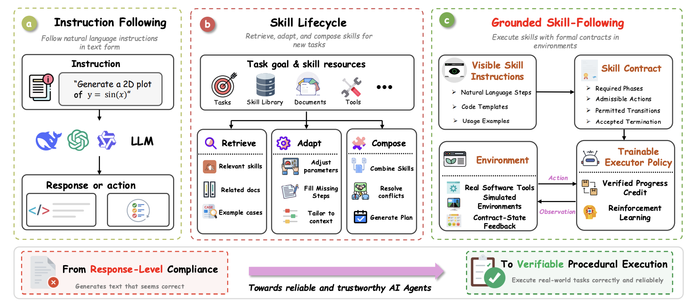
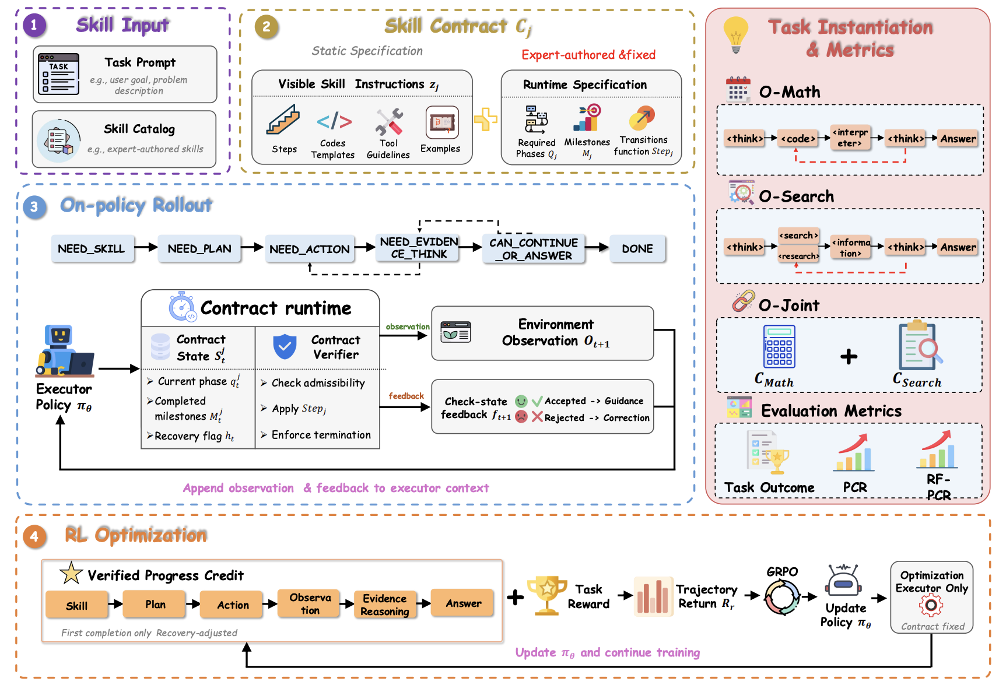
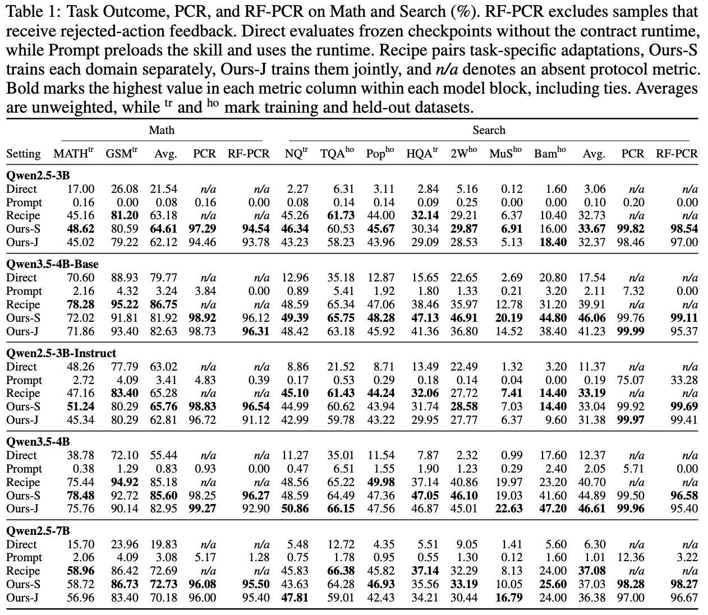
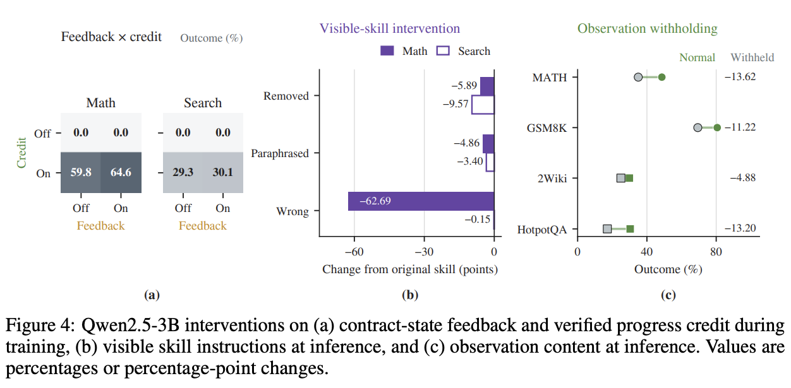
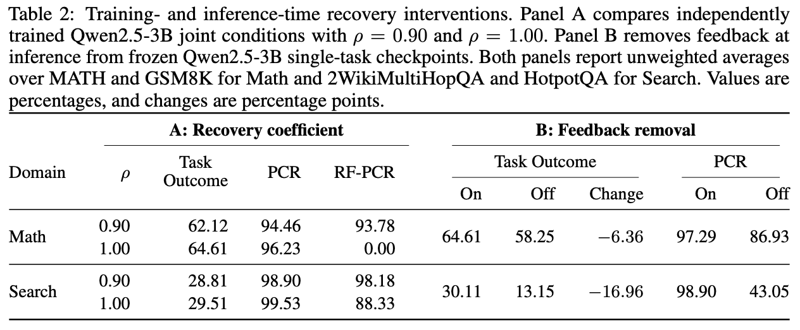

<!-- LOCKED: false -->

<h1 align="center">Grounded Skill-Following</h1>

<p align="center">
  
</p>

This repository contains the **Qwen3.5-4B** code for *Grounded Skill-Following*. It trains an agent to follow a fixed, expert-written skill across multiple steps. A **skill contract** checks each action, gives feedback, and credits verified progress. Training uses [slime](https://github.com/THUDM/slime).

The release has three training settings: **O-Math**, **O-Search**, and **O-Joint**. It also includes the Qwen3.5-4B Direct, Prompt, ReTool-style, and Search-R1-style comparison entry points.

An optional, post-paper Search setting gives **0.10 credit for the first valid `<research>` call**. It is separate from the paper's O-Search setting, whose first-research credit remains zero.

## Research questions

The paper asks three questions:

1. **RQ1 — Grounded skill-following:** Does contract training help agents complete the skill protocol and solve Math and Search tasks across different models? The three main Qwen3.5-4B settings are in [`experiments.json`](code/config/experiments.json). [`protocol.py`](code/skill_following/protocol.py) checks completion, and [`reward.py`](code/skill_following/reward.py) measures task outcomes.
2. **RQ2 — Training behavior:** How do verified progress credit, contract-state feedback, and the recovery coefficient affect learning? These signals are implemented in [`reward.py`](code/skill_following/reward.py), [`state.py`](code/skill_following/state.py), and [`registry.py`](code/skill_following/registry.py).
3. **RQ3 — Inference behavior:** Does execution depend on visible skill instructions, environment observations, and contract-state feedback? [`contracts.py`](code/skill_following/contracts.py) and [`prompts.py`](code/skill_following/prompts.py) provide the instructions; [`protocol.py`](code/skill_following/protocol.py) handles observations and feedback.

<p align="center">
  
</p>

**Scope:** This repository provides the Qwen3.5-4B main settings and an optional post-paper Search reward setting. The paper's controlled RQ2 and RQ3 experiments use Qwen2.5-3B; their experiment presets are not included here. The figures below show the paper's results, not Qwen3.5-4B reruns of those controls.

## What you need

- **Hardware:** four NVIDIA GPUs for the reported training settings, with tensor parallelism 2. Math and Search run for 200 rollout rounds; Joint runs for 400.
- **Software:** a working [slime environment](https://github.com/THUDM/slime/blob/main/docs/en/get_started/quick_start.md) with Megatron-LM, SGLang, Ray, and Python packages used by slime. The slime Docker image is the easiest starting point. The release scripts also use `pandas`, `pyarrow`, `omegaconf`, and `huggingface_hub`.
- **Models:** [Qwen/Qwen3.5-4B](https://huggingface.co/Qwen/Qwen3.5-4B). Search also needs [intfloat/e5-base-v2](https://huggingface.co/intfloat/e5-base-v2).
- **Data:** the MATH, GSM8K, Natural Questions, HotpotQA, and full evaluation views listed below. Search needs a 2018 Wikipedia corpus and a matching FAISS index.

Model weights, datasets, the Wikipedia corpus, the index, checkpoints, and logs are **not** included.

## Quick start

**1. Put this repository next to slime's training files.** The commands below assume this repository is checked out as `grounded-skill-following` inside the slime root.

```bash
git clone https://github.com/THUDM/slime.git
cd slime
git clone https://github.com/MrToser/skill-following.git grounded-skill-following

export ROOT_PATH="$PWD"
export GSF_ROOT="$ROOT_PATH/grounded-skill-following"
export PYTHON_BIN=python3
export SF_SOURCE_DATA_ROOT="$ROOT_PATH/data"

# In the slime Docker image, Megatron-LM is usually at /root/Megatron-LM.
if [ ! -e "$ROOT_PATH/Megatron-LM" ] && [ -d /root/Megatron-LM ]; then
  ln -s /root/Megatron-LM "$ROOT_PATH/Megatron-LM"
fi
export PYTHONPATH="$GSF_ROOT/code:$GSF_ROOT/code/data_prep:$ROOT_PATH/Megatron-LM:$ROOT_PATH/examples/search-r1:$ROOT_PATH/examples/retool:$ROOT_PATH"
python -m pip install -e . --no-deps
python -m skill_following.registry list
```

**2. Download Qwen3.5-4B and convert it for Megatron.**

```bash
bash "$GSF_ROOT/scripts/models/download_model_snapshot.sh" qwen35_4b
bash "$GSF_ROOT/scripts/models/prepare_model_reference.sh" qwen35_4b
```

The default paths are `$ROOT_PATH/model/Qwen3.5-4B` and `$ROOT_PATH/model/Qwen3.5-4B_torch_dist`. Conversion is ready when the latter contains `latest_checkpointed_iteration.txt`. For Search and Joint, also download the retriever model:

```bash
hf download intfloat/e5-base-v2 --local-dir "$ROOT_PATH/model/e5-base-v2"
```

**3. Provide the paper data.** Set `SF_SOURCE_DATA_ROOT` to the folder containing these inputs:

| Required input, relative to `SF_SOURCE_DATA_ROOT` | Expected content |
|---|---|
| `01_source_data/raw/hendrycks_math/*/train-*.parquet` | 7,500 MATH rows with `problem` and `solution` |
| `01_source_data/raw/gsm8k/train.parquet` | 7,473 GSM8K rows with `question` and `label` |
| `02_prepared_data/unified_search_code_v0_001/train.parquet` | 79,168 NQ and 90,447 HotpotQA rows |
| `02_prepared_data/main_table_eval_v0_005/joint_ours_500step_full_dataset/eval_*.parquet` | Nine full evaluation files: MATH, GSM8K, NQ, TriviaQA, PopQA, HotpotQA, 2WikiMultiHopQA, MuSiQue, and Bamboogle |

The historical folder names are input paths expected by the code. [`code/data_prep/`](code/data_prep/) contains converters for source data. **The repository does not yet include a single command that downloads every original dataset and builds these exact views.** Use the stated splits and row counts; the preparation script stops if an input is missing or does not match.

```bash
bash "$GSF_ROOT/scripts/core/prepare_data.sh"
VERIFY_ONLY=1 bash "$GSF_ROOT/scripts/core/prepare_data.sh"
```

For Search and Joint, place the retriever assets at `$ROOT_PATH/Index/wiki-18.jsonl`, `$ROOT_PATH/Index/e5_Flat.index`, and `$ROOT_PATH/model/e5-base-v2`. Override them with `CORPUS_PATH`, `INDEX_PATH`, and `RETRIEVER_MODEL` if needed. The run scripts start the local top-3 retriever. See slime's [Search-R1 example](https://github.com/THUDM/slime/tree/main/examples/search-r1) for the retriever setup.

**4. Check, train, and evaluate.** Start with Math; it does not need the retriever. Replace the experiment ID with `main_qwen35_4b_o_search` or `main_qwen35_4b_o_joint` for the other settings.

```bash
python -m skill_following.registry list
bash "$GSF_ROOT/scripts/core/run_experiment.sh" main_qwen35_4b_o_math --dry-run
bash "$GSF_ROOT/scripts/core/run_experiment.sh" main_qwen35_4b_o_math
bash "$GSF_ROOT/scripts/core/run_experiment.sh" main_qwen35_4b_o_math --phase eval
python -m skill_following.reporting.analysis --allow-missing
```

`--dry-run` checks configuration and required files before using GPUs. Evaluation needs the checkpoint from training. Outputs are written under `data/` in this repository and ignored by Git. To check all three settings and the local source code, run `bash "$GSF_ROOT/scripts/core/validate_suite.sh"` after preparing the data.

For Qwen3.5-4B, the chat template can end with an open `<think>` tag. The runtime ignores the first generated completion of that tag when counting protocol actions and recovery. A later invalid action still counts as recovery. Evaluation reports PCR and recovery-free PCR separately. To audit a saved evaluation from the older runtime, run `python -m skill_following.reporting.prefill_audit "$GSF_ROOT/data/artifacts/main_qwen35_4b_o_search/seed_20260814/eval/samples.jsonl"`. The audit prints the original and first-think-excluded rates without changing the saved trajectories or rewards.

For the optional first-research-credit Search run, use `diag_qwen35_4b_o_search_first_research_reward` in the same training and evaluation commands. It uses the same Qwen3.5-4B model, Search data, 200 rollout rounds, and recovery factor 0.9 as O-Search. Only the first accepted `<research>` call with a valid observation receives the extra 0.10. This setting was evaluated after the paper experiments and is not represented by the paper figures below.

## Repository layout

| Path | Purpose |
|---|---|
| [`code/skill_following/`](code/skill_following/) | Contract runtime, training callbacks, reward, model/data utilities |
| [`code/config/experiments.json`](code/config/experiments.json) | Three paper settings and the optional first-research-credit Search setting |
| [`code/data_prep/`](code/data_prep/) | Source-data converters |
| [`scripts/core/`](scripts/core/) | Main training, evaluation, and data preparation commands |
| [`scripts/models/`](scripts/models/) | Model download and Megatron conversion |
| [`scripts/baselines/`](scripts/baselines/) | Direct, Prompt, ReTool-style, and Search-R1-style comparisons |
| [`assets/`](assets/) | Method illustrations and paper result figures |
| [`figures/`](figures/) | PDF versions and rendered copies of the two method diagrams |

## Results

### RQ1: Grounded skill-following

<p align="center">
  
</p>

<p align="center"><sub>Paper Table 1: task outcomes, protocol completion (PCR), and recovery-free PCR across models. The released main settings correspond to the Qwen3.5-4B Ours-S and Ours-J rows.</sub></p>

### RQ2 and RQ3: Training and inference behavior

These controlled paper experiments use Qwen2.5-3B. In Figure 4, panel (a) addresses RQ2; panels (b) and (c) address RQ3.

<p align="center">
  
</p>

<p align="center"><sub>Paper Figure 4: training feedback and verified progress credit (RQ2); visible skill instructions and observation content at inference (RQ3).</sub></p>

In Table 2, panel A compares recovery coefficients for RQ2; panel B removes inference-time feedback for RQ3.

<p align="center">
  
</p>

<p align="center"><sub>Paper Table 2: recovery coefficient during training (RQ2) and feedback removal at inference (RQ3).</sub></p>

**Answers to the three questions.** RQ1: contract-trained agents usually complete the protocol, but answer accuracy does not improve in every setting. RQ2: verified progress credit enables learning in the tested controls; feedback helps, and a recovery coefficient of 0.90 improves recovery-free completion in the tested joint runs while trading off some task accuracy. RQ3: visible skill instructions, observation content, and contract-state feedback all affect execution, with feedback removal hurting Search more than Math. The RQ2 and RQ3 findings come from Qwen2.5-3B controls and have not been rerun on Qwen3.5-4B in this release.

## Acknowledgements and license

This repository is released under the [Apache License 2.0](LICENSE). It builds on [slime](https://github.com/THUDM/slime), [Megatron-LM](https://github.com/NVIDIA/Megatron-LM), [SGLang](https://github.com/sgl-project/sglang), [Search-R1](https://github.com/PeterGriffinJin/Search-R1), and the Qwen model family. Third-party dependencies, models, and datasets retain their own licenses and terms.
