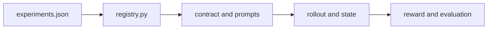

<!-- LOCKED: false -->

# Code

This folder contains the Qwen3.5-4B method, data conversion, and comparison code. The experiment registry selects one of the three released settings and passes its paths to the training scripts.

| Path | Purpose |
|---|---|
| [`skill_following/`](skill_following/) | Skill contracts, state machine, rollout, reward, model and data utilities |
| [`config/experiments.json`](config/experiments.json) | Qwen3.5-4B Math, Search, and Joint settings |
| [`data_prep/`](data_prep/) | Converters for original Math and Search data |
| [`baselines/`](baselines/) | Direct, Prompt, and source-method adapters |
| [`legacy_retool/`](legacy_retool/) | ReTool-style baseline data and runtime components |
| [`figures/`](figures/) | Source scripts for the method diagrams and Qwen3.5-4B result plot |

All source files in this folder are `LOCKED: false`. Runtime files belong in the repository's ignored `data/` folder.
