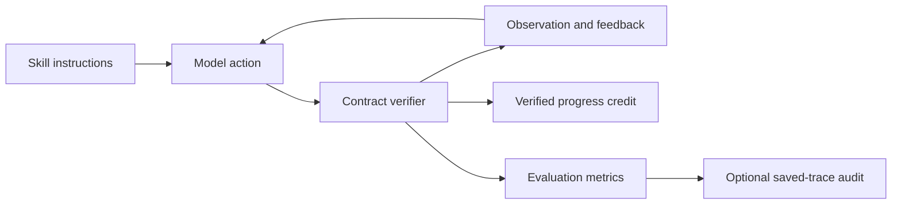

<!-- LOCKED: false -->

# Skill-following runtime

The same runtime supports O-Math, O-Search, and O-Joint. It combines visible instructions with a verifier that tracks the current phase, accepted actions, recovery, and completed milestones. The model sees feedback after nonterminal actions. Verified first-time progress contributes to the training return.

| Path | Purpose |
|---|---|
| [`contracts.py`](contracts.py), [`prompts.py`](prompts.py) | Visible skill instructions and action formats |
| [`state.py`](state.py), [`protocol.py`](protocol.py) | Phases, action checks, and transitions |
| [`rollout.py`](rollout.py), [`entrypoint.py`](entrypoint.py) | Agent interaction and slime callbacks |
| [`reward.py`](reward.py) | Task reward and verified progress credit |
| [`data/`](data/), [`models/`](models/) | Paper data views and Qwen3.5-4B download |
| [`reporting/`](reporting/), [`telemetry/`](telemetry/) | Result summaries and traces |
| [`tests/`](tests/) | Runtime and registry checks |
| [`retool_base/`](retool_base/) | Shared protocol helpers |

The released experiment IDs are in [`../config/experiments.json`](../config/experiments.json). Files here are `LOCKED: false`.

The optional `diag_qwen35_4b_o_search_first_research_reward` setting adds 0.10 credit when the first accepted `<research>` call returns a valid observation. [`protocol.py`](protocol.py) records that milestone once; [`reward.py`](reward.py) applies the configured credit and recovery factor. The three paper settings use zero first-research credit.

When Qwen's chat template pre-opens `<think>`, the first generated `</think>` closes that template field. [`rollout.py`](rollout.py) skips it as a protocol action and gives a neutral next-step hint. Later invalid actions still trigger recovery. [`reward.py`](reward.py) reports PCR and recovery-free PCR separately. [`reporting/prefill_audit.py`](reporting/prefill_audit.py) streams older `samples.jsonl` files and calculates a separate first-think-excluded RF-PCR; it does not rewrite historical trajectories, feedback, or rewards.
