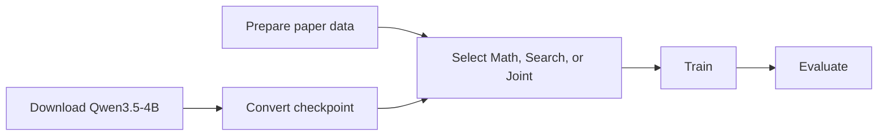

<!-- LOCKED: false -->

# Scripts

Run these commands from the slime root with `ROOT_PATH` and `PYTHONPATH` set as shown in the [main README](../README.md).



| Path | Purpose |
|---|---|
| [`models/`](models/) | Download Qwen3.5-4B and convert it to Megatron format |
| [`core/`](core/) | Prepare data, validate inputs, train, and evaluate the three main settings |
| [`baselines/`](baselines/) | Run Qwen3.5-4B Direct, Prompt, ReTool-style, and Search-R1-style comparisons |

Check a setting before running it:

```bash
bash "$GSF_ROOT/scripts/core/run_experiment.sh" main_qwen35_4b_o_math --dry-run
```

These scripts are `LOCKED: false`. The baseline scripts need the same model and data setup as the main settings.
